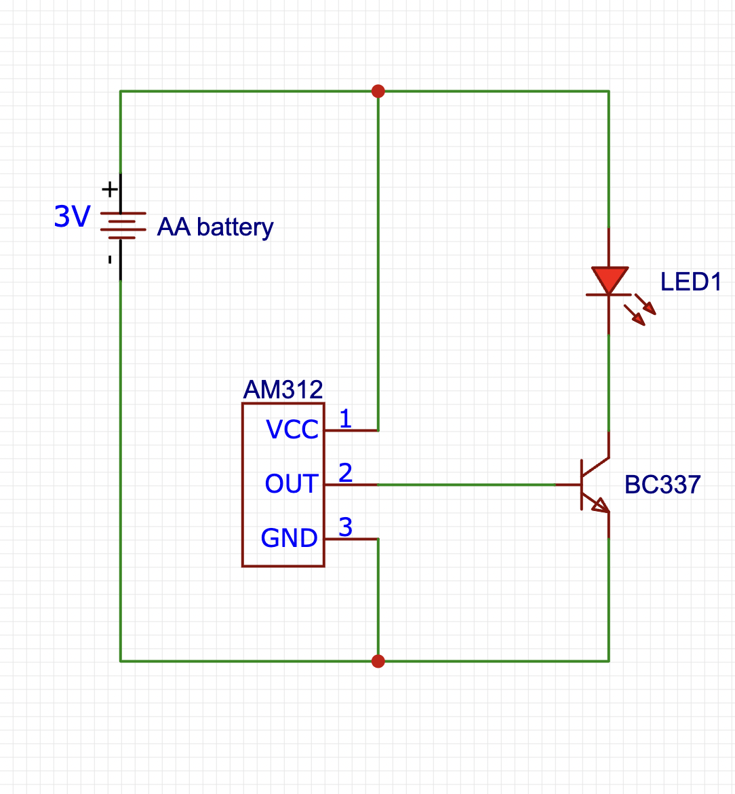

# PIR sensor on AA

This is a dead-simple cheap way of getting a motion detector that can run for about a year on two AA batteries. I had mine running for over 6 months already and the batteries are still nearly full.

The parts needed (affiliate links):

PIR sensor:  https://s.click.aliexpress.com/e/_DFv3u7H
NPN transistor: https://s.click.aliexpress.com/e/_DCfZT1V
LED: https://s.click.aliexpress.com/e/_DeO25ll

For AA batteries, it's best to find whatever brand is available locally for you. You will also need some wire. The length will depend on where you want the sensor and LED or some other notification device.

Instead of an LED you could connect it to another device that can relay the detection to a server and add it into a HomeAssistant integration.

Circuit:

In a proper circuit, there would also be a resistor in series with the LED and on the base of the NPN, but thanks to the cheap components, there is enough internal resistance to not require either.
